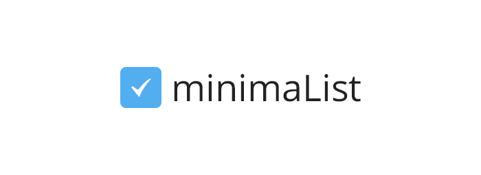

## At last! I launched my simple list app, [minimaList](http://getminimalist.com). You can follow the app or ask questions on twitter: [@get_minimalist](http://twitter.com/get_minimalist)

In early 2012, I started developing minimaList for my wife and I. We needed a simple way to share lists without the hassle or formality of user accounts. I had been itching to get familiar with Backbone.js and use some Rails skills. Today I launched the app. So go, make some lists!

<figure></figure>

### Updates
1. Featured on [One Page Love](http://onepagelove.com/minimalist) and [mmminimal](http://mmminimal.com/introducing-minimalist-a-hassle-free-list-app/). Thanks Rob! (9/18/2012)
2. Now a CSS Design Awards nominee! (9/19/2012)

Follow the app on Twitter: [@get_minimalist](http://twitter.com/get_minimalist)